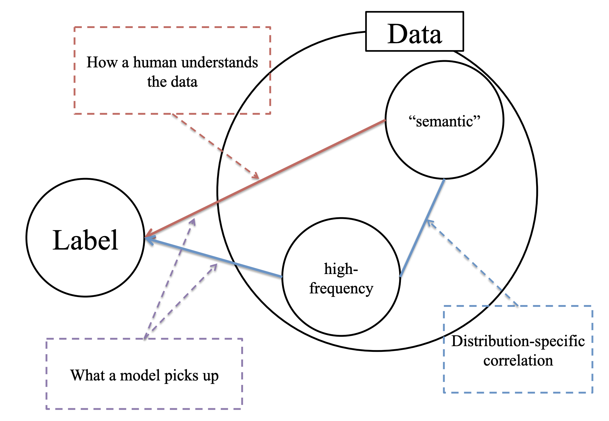
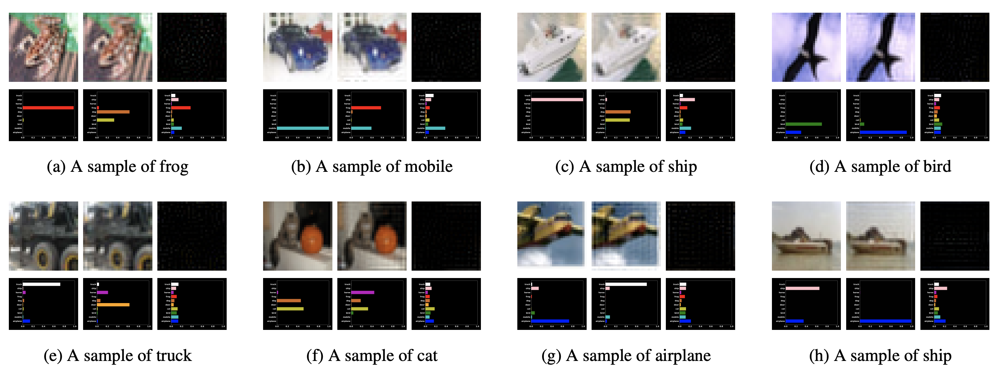

# High Frequency Component Helps Explain the Generalization of Convolutional Neural Networks 
- [H. Wang, X. Wu, Z. Huang, and E. P. Xing. "High frequency component helps explain the generalization of convolutional neural networks." CVPR 2020 (Oral).](https://arxiv.org/abs/1905.13545) 

|The central hypothesis of our paper: within a data collection, there are correlations between the highfrequency components and the “semantic” component of the images. As a result, the model will perceive both high-frequency components as well as the “semantic” ones, leading to generalization behaviors counterintuitive to human (e.g., adversarial examples).|  
 |:--|---|

### Code Structures

### Before using the code
